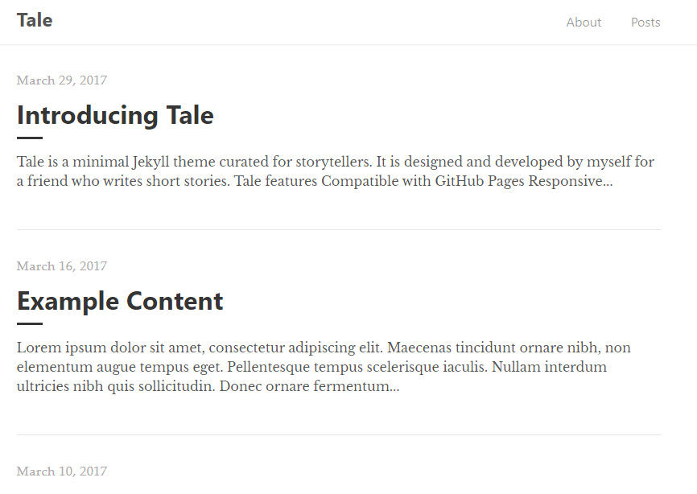
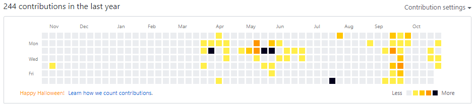
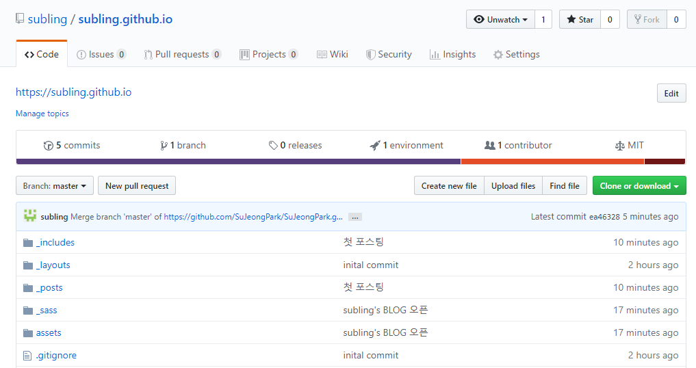

 
## 첫 개발블로그의 첫 포스팅

jekyll을 이용하여 subling's BLOG를 만들었다. jekyll을 사용하기 위해 ruby부터 설치하는 과정을 거쳤다. 설치부터 블로그 생성하기까지의 과정은 아래의 링크를 참고했다.

 > [[Jekyll] 윈도우에서 지킬 설치 및 블로그 생성하기](https://shryu8902.github.io/jekyll/jekyll-on-windows/)

  
ruby를 설치하고 나서 수많은 jekyll theme를 접하게 되었다. [이곳](http://jekyllthemes.org/)에서 많은 테마들을 살펴볼 수 있다. 너무 많은 테마들이 있어 무엇을 해야할지 고민되었다. 고민 끝에 깔끔한 디자인을 갖춘 tale을 선택했다.  

  
 처음에는 fork를 통해 블로그를 만들려고 하였으나 내 github의 초록잔디를 위해 jekyll theme를 직접 다운로드받아 만들게 되었다.  
 
 
자라나라 잔디잔디

   
 subling.github.io로 새 repository를 생성하고 다운받은 tale의 폴더를 repository에 넣어주었다. 이후 _config.yml 파일을 수정하였다. 드디어 subling's BLOG가 만들어졌다.  
 

 
> 아무래도 첫 포스팅이다 보니 글을 어떻게 써야할지 어려움이 느껴졌다.  <del>그래서 어떻게 마무리해야할지 잘 모르겠다.ㅎㅎ</del>

 
## 포스팅을 끝마치며...

첫 포스팅을 작성했는데 이렇게 만들어진 블로그를 보니 뿌듯하다. 앞으로 알게된 것이나 정리하고 싶은 것들을 기록하는 공간으로 subling's BLOG를 채워나가야겠다!
